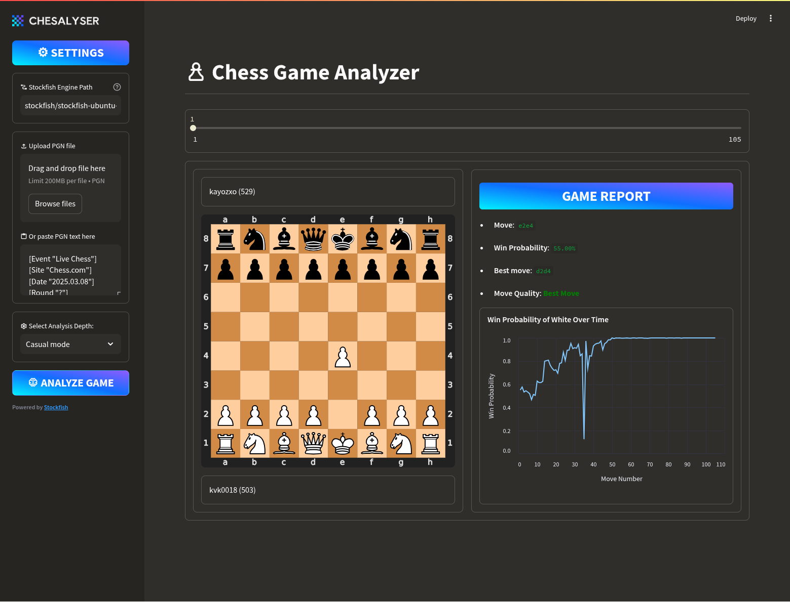

---

[](https://streamlit.io/)
[](https://www.python.org/)
[](https://stockfishchess.org/)

A powerful chess game analyzer built with Python and Streamlit, leveraging Stockfish for position evaluation. Provides detailed move analysis, win probability tracking, and interactive game review.



## 🌟 Features

- **PGN File Analysis**: Upload games or paste PGN text directly
- **Move Classification**:
  - 🟢 Best Move 🟦 Good Move 🟡 Inaccuracy 🟠 Mistake 🔴 Blunder
- **Interactive Chess Board**: SVG-based board visualization
- **Win Probability Graph**: Track advantage fluctuations through the game
- **Multi-Depth Analysis**: Choose from 5 analysis modes (Beginner to Stockfish)
- **Game Metadata Display**: Player names, Elo ratings, and game results
- **Modern UI**: Gradient headers and responsive design

## ⚙️ Installation

### Prerequisites

- Python 3.9+
- Stockfish engine (installation varies by OS)

### All Platforms

```bash
# Clone repository
git clone https://github.com/kayozxo/chesalyser.git
cd chesalyser

# Install Python dependencies
pip install -r requirements.txt
```

### OS-Specific Setup

#### **Windows**

1. Download Stockfish:
   - [Official Windows build](https://stockfishchess.org/download/windows/)
   - Extract ZIP.
2. Update engine path in the provided text area in sidebar.

#### **macOS**

```bash
# Using Homebrew (recommended)
brew install stockfish

# Or manual download:
# 1. Get macOS build from https://stockfishchess.org/download/mac/
# 2. Make executable:
chmod +x stockfish/stockfish-macos-x86-64

#3. Update engine path in the provided text area in sidebar.
```

#### **Linux**

```bash
# Clone this repository

# Make executable
chmod +x stockfish/stockfish-ubuntu-x86-64-sse41-popcnt
```

## 🚀 Usage Notes

- **First Run**: The app may take 30-60 seconds to initialize Stockfish
- **Windows Users**: Add exception for Stockfish in your antivirus if needed
- **M1/M2 Mac Users**: Use Rosetta if using x86 build, or compile ARM version

## 🚨 Troubleshooting

**Platform-Specific Issues**

| OS      | Common Fixes                                                               |
| ------- | -------------------------------------------------------------------------- |
| Windows | 1. Add `.exe` extension if missing<br>2. Run as Administrator              |
| macOS   | 1. `xattr -cr stockfish/...` (remove quarantine flags)<br>2. Use ARM build |
| Linux   | 1. Install `libnss3` if missing<br>2. Check 32/64-bit compatibility        |

## 🚀 Usage

1. Start the application:

```bash
streamlit run main.py
```

2. In the sidebar:

   - Paste your engine path (linux users: ignore this step)
   - Upload PGN file or paste game text
   - Select analysis depth (Beginner to Stockfish mode)
   - Click "ANALYZE GAME"

3. Explore results:
   - Interactive move slider
   - Chess board visualization
   - Move quality assessment
   - Win probability graph
   - Best move suggestions

## 📊 Analysis Metrics

| Metric               | Description                                         |
| -------------------- | --------------------------------------------------- |
| Win Probability      | White's winning chances based on current evaluation |
| Centipawn Evaluation | Numeric assessment of position advantage            |
| Score Change         | Difference in evaluation from previous move         |
| Piece Moved          | Type of piece moved (Queen, Knight, etc.)           |
| Capture Detection    | Identifies if move resulted in capture              |

## 🛠️ Customization

Modify these components for different behavior:

1. **Analysis Depth Settings** (in `main.py`):

```python
depth_options = {
    10: "Beginner mode",
    15: "Casual mode",
    20: "Serious mode",
    25: "Grandmaster mode",
    30: "Stockfish mode",
}
```

2. **Move Classification Thresholds** (in `classify_move()` function):

```python
# Adjust these values for different move ratings
if is_capture:
    if score_change < 30:  # Modify these thresholds
        return "Best Move", "green"
```

## 🚨 Troubleshooting

**Common Issues**:

1. **Stockfish Not Found**:

   - Verify executable path in sidebar settings
   - Ensure correct permissions: `chmod +x stockfish/...`

2. **PGN Parsing Errors**:

   - Validate PGN format using [PGN Validator](https://www.chess.com/pgn-viewer)
   - Ensure game headers are present

3. **Analysis Timeouts**:
   - Reduce analysis depth
   - Use better hardware for deep analysis

## 📜 License

MIT License - See [LICENSE](LICENSE) for details

## 🤝 Credits

- Chess engine: [Stockfish](https://stockfishchess.org/)
- Chess library: [python-chess](https://python-chess.readthedocs.io/)
- UI Framework: [Streamlit](https://streamlit.io/)

---

**Disclaimer**: This project is not affiliated with Chess.com or Lichess. Intended for educational purposes only. Use at your own risk in competitive environments.
